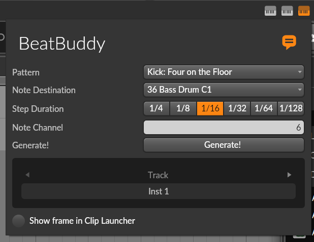

# BeatBuddy - Bitwig Studio Extension for Generating Drum Patterns (v0.6.0)

## ⚙️ Installation:

1. ⬇️ Download **_BeatBuddy.bwextension_**  
2. 📂 Copy **_BeatBuddy.bwextension_** to the **_/Bitwig Studio/Extensions/_** folder  
3. 🟧 In Bitwig, go to **Settings > Controller > Add Extension > Centomila > BeatBuddy**  

---

# 🚀 Coming Soon

- [ ] Setting for custom clip length  
- [ ] Setting for random patterns  
- [ ] Option to remove excess notes if the user generates a pattern longer than the clip  
- [ ] MOAAAR PATTERNS!
- [ ] Support for custom patterns via TXT files  
- [ ] A decent README!

[View Changelog](CHANGELOG.md)  