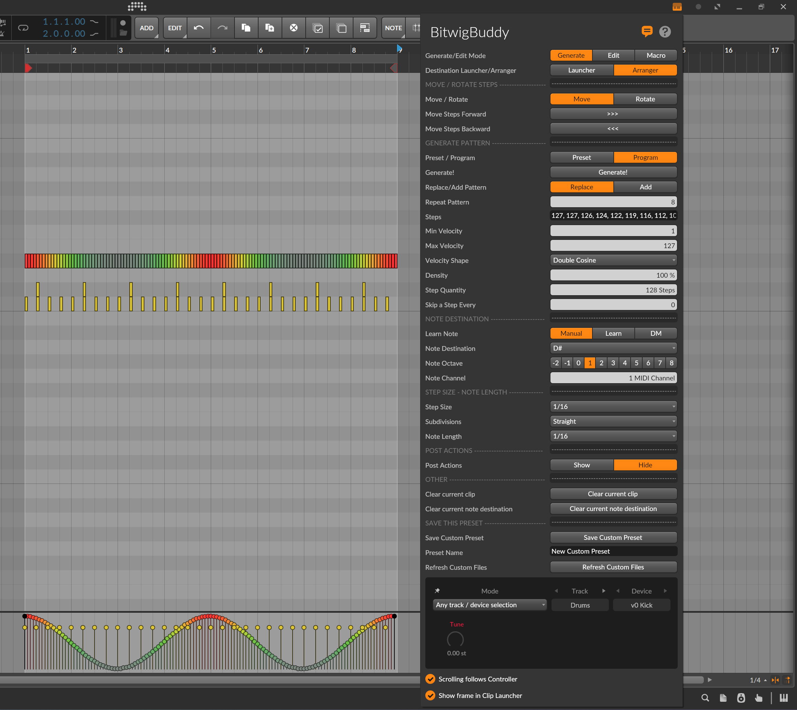

Version 0.4

# BeatBuddy - Bitwig Studio Extension to generator drum patterns

Super alpha version!

# ⚙️ Installation:

1. ⬇️ Download _BeatBuddy.bwextension_
2. 📂 Copy _BeatBuddy.bwextension_ to _/Bitwig Studio/Extensions_ folder
3. 🟧 In Bitwig go to Settings > Controller > Add Extension > Centomila > BeatBuddy

---

# 📋 Changelog:

**0.52**
- [X] Replaced the old method to select note destination with a new method to select note destination based on Note Name+Octave

0.5
- [X] Support for multiple step sizes and note lengths in the pattern!
  - 1/2  |  1/4  |  1/8  |  1/8  |  1/16  |  1/32  |  1/32  |  1/64  |  1/128
  - 1/2 - 3t  |  1/4 - 3t  | 1/8 - 3t  |  1/16 - 3t  |  1/32 - 3t  |  1/32 - 3t  |  1/64 - 3t  |  1/128 - 3t
- [X] Button to clear the pattern of all notes
- [X] Renamed some fields for clarity
- [X] Tooltip notification with the current note name when the user change the note destination or a MIDI Note number.

0.45
- [X] Support for clip in the arranger with the _Launcher/Arranger_ option

0.4
- [X] Separated fields for changing the note destination  
- [X] Added a Show/Hide button for note destination fields  
- [X] Removed GMDrums as the default note destination selector  
- [X] Removed _Track Cursor_  
- [X] Moved the Generate button to the top of the UI  
- [X] Refactored the code  
- [X] Added Random pattern!

---

# ✅ TODO:

- [ ] Support for multiple length patterns
- [ ] MOAR PATTERNS!
- [ ] Settings for random pattern.
- [ ] Option to Remove notes in excess if the user generate a pattern longer than the clip
- [ ] Automatically change the note length based on the step size (not the other way around)
- [ ] Make a decent Readme!
